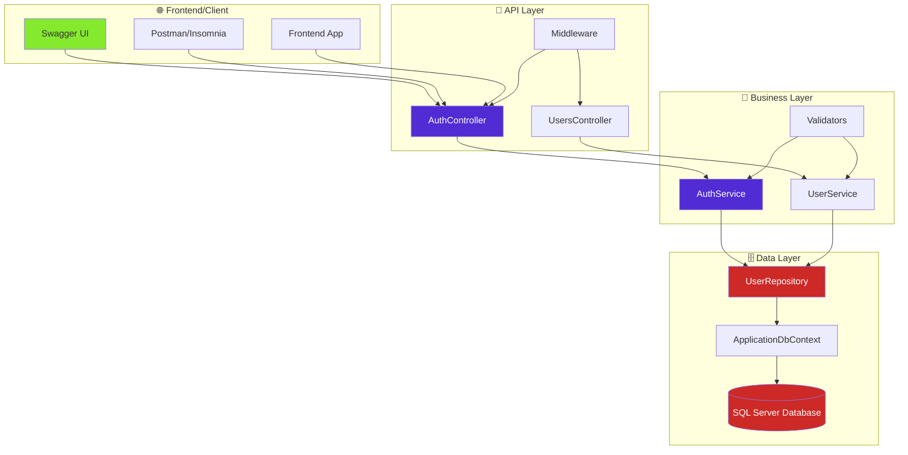

# 🔐 SafeScribe API - CP5 JWT Authentication


## 📋 Sobre o Projeto

A startup **SafeScribe** está desenvolvendo uma plataforma inovadora para gestão de notas e documentos sensíveis voltada para equipes corporativas. A segurança e o controle de acesso são os pilares do produto. Este projeto implementa o núcleo da API RESTful da SafeScribe, com sistema de autenticação e autorização seguro utilizando JSON Web Tokens (JWT).

## 🎯 Missão

Construir o núcleo da API RESTful da SafeScribe, implementando um sistema de autenticação e autorização seguro utilizando JSON Web Tokens (JWT).

## 🛠️ Tecnologias Utilizadas


## 🏗️ Arquitetura

### Diagrama de Arquitetura



## 🚀 Como Executar

### 📋 Pré-requisitos

-  .NET 8.0 SDK ou superior
-  SQL Server LocalDB
-  Git

### 🛠️ Passos para Execução

```bash
# 1. Clone o repositório
git clone https://github.com/carmipa/Advanced_Business_Development_with_.NET_CP_2SEM_2025.git
cd Advanced_Business_Development_with_.NET_CP_2SEM_2025/cp-5-autenticacao-autorizacao-swt

# 2. Restaure as dependências
dotnet restore

# 3. Execute as migrações do banco de dados
dotnet ef database update

# 4. Execute o projeto
dotnet run --urls "http://localhost:5210"
```

### ✅ Verificação de Instalação

```bash
# Verificar se o .NET está instalado
dotnet --version

# Verificar se o projeto compila
dotnet build

# Verificar se o banco foi criado
dotnet ef database update
```

## 🔗 Acesso à API

| Serviço | URL | Status |
|---------|-----|--------|
|  | [http://localhost:5210/swagger](http://localhost:5210/swagger) |  |
|  | [http://localhost:5210/swagger/v1/swagger.json](http://localhost:5210/swagger/v1/swagger.json) |  |

## 📚 Documentação

- [📖 Manual de Testes](manual_de-testes.md) - Guia completo de testes da API com Swagger UI
- [📊 Diagramas](diagramas.md) - Diagramas de arquitetura e fluxos em Mermaid
- [🚀 Exemplos de Uso](exemplos-de-uso.md) - Exemplos práticos com cURL, JavaScript, Python e Postman
- [🔗 Swagger UI](http://localhost:5210/swagger) - Documentação interativa da API

## 🔐 Funcionalidades Implementadas

### ✅ Autenticação
-  **Registro de Usuários** - Criação de novas contas
-  **Login** - Autenticação com email e senha
-  **Validação de Token** - Verificação de tokens JWT
-  **Refresh Token** - Renovação de tokens (em desenvolvimento)
-  **Logout** - Invalidação de tokens

### 👤 Gerenciamento de Usuários
-  **Perfil do Usuário** - Visualização de dados pessoais
-  **Busca por ID** - Consulta de usuário específico
-  **Lista de Usuários** - Listagem (Admin only)
-  **Atualização** - Edição de dados (em correção)

### 🛡️ Segurança
-  **JWT Authentication** - Tokens seguros
-  **Autorização por Roles** - Controle de acesso
-  **Validação de Dados** - FluentValidation
-  **Hash de Senhas** - BCrypt
-  **Tratamento de Erros** - Middleware global

## 📊 Status dos Endpoints

| Endpoint | Método | Status | Autenticação | Observações |
|----------|--------|--------|--------------|-------------|
| `/api/auth/register` | POST |  | ❌ | Criação de usuários |
| `/api/auth/login` | POST |  | ❌ | Autenticação |
| `/api/auth/validate` | GET |  | ✅ | Validação de token |
| `/api/auth/refresh-token` | POST |  | ❌ | Refresh token invalidação |
| `/api/auth/logout` | POST |  | ✅ | Logout |
| `/api/users/profile` | GET |  | ✅ | Perfil do usuário |
| `/api/users/{id}` | GET |  | ✅ | Busca por ID |
| `/api/users` | GET |  | ✅ | Lista (Admin only) |
| `/api/users/{id}` | PUT |  | ✅ | Atualização com erro |

## 🧪 Como Testar

### 1. 🌐 Swagger UI (Recomendado)
1. Acesse [http://localhost:5210/swagger](http://localhost:5210/swagger)
2. Clique em "Try it out" em qualquer endpoint
3. Preencha os dados necessários
4. Clique em "Execute"

### 2. 📱 cURL
```bash
# Registro
curl -X POST "http://localhost:5210/api/auth/register" \
  -H "Content-Type: application/json" \
  -d '{"nome": "João Silva", "email": "joao@exemplo.com", "senha": "MinhaSenh@123", "confirmarSenha": "MinhaSenh@123"}'

# Login
curl -X POST "http://localhost:5210/api/auth/login" \
  -H "Content-Type: application/json" \
  -d '{"email": "joao@exemplo.com", "senha": "MinhaSenh@123"}'
```

### 3. 🐍 Python
```python
import requests

# Login
response = requests.post("http://localhost:5210/api/auth/login", json={
    "email": "joao@exemplo.com",
    "senha": "MinhaSenh@123"
})

token = response.json()["token"]

# Usar token
headers = {"Authorization": f"Bearer {token}"}
profile = requests.get("http://localhost:5210/api/users/profile", headers=headers)
print(profile.json())
```

## 📈 Métricas de Qualidade


| Categoria | Total | ✅ Sucesso | ❌ Falha | ⚠️ Problemas |
|-----------|-------|------------|----------|--------------|
|  | 5 | 4 | 0 | 1 |
|  | 3 | 2 | 0 | 1 |
|  | 4 | 4 | 0 | 0 |
| **Total** | **12** | **10** | **0** | **2** |

## 🔧 Troubleshooting

### ❌ Problemas Comuns

#### 1. **Erro 500 - Erro Interno do Servidor**
```
Sintoma: Status 500 em todos os endpoints
Causa: Banco de dados não criado
Solução: Execute `dotnet ef database update`
```

#### 2. **Erro 404 - Swagger não encontrado**
```
Sintoma: Cannot GET /swagger
Causa: Projeto não está rodando
Solução: Execute `dotnet run --urls "http://localhost:5210"`
```

#### 3. **Erro 401 - Token Inválido**
```
Sintoma: 401 Unauthorized em endpoints protegidos
Causa: Token JWT inválido ou expirado
Solução: Faça login novamente para obter novo token
```

### 🛠️ Comandos de Diagnóstico

```bash
# Verificar se o projeto compila
dotnet build

# Verificar migrações pendentes
dotnet ef migrations list

# Aplicar migrações
dotnet ef database update

# Verificar conectividade
curl -I http://localhost:5210/swagger
```

## 👥 Equipe de Desenvolvimento

| Nome | RM | GitHub | Responsabilidade |
|------|----|---------|------------------|
|  |  | [](https://github.com/carmipa) | Backend & JWT |
|  |  | [](https://github.com/JouTiago) | Testes & Documentação |
|  |  | [](https://github.com/mandyy14) | Arquitetura & DevOps |

## 🔗 Links Úteis

-  [Repositório Principal](https://github.com/carmipa/Advanced_Business_Development_with_.NET_CP_2SEM_2025)
-  [Projeto CP5](https://github.com/carmipa/Advanced_Business_Development_with_.NET_CP_2SEM_2025/tree/main/cp-5-autenticacao-autorizacao-swt)
-  [Swagger UI](http://localhost:5210/swagger)

## 📅 Informações do Projeto

- **Data de Entrega**: 20/10/2025
- **Grupo**: Até 3 pessoas
- **Status**: 

## 📄 Licença


Este projeto está licenciado sob a Licença MIT - veja o arquivo [LICENSE](LICENSE) para detalhes.

---

<div align="center">


**Desenvolvido com ❤️ pela equipe SafeScribe - FIAP 2025**


</div>
