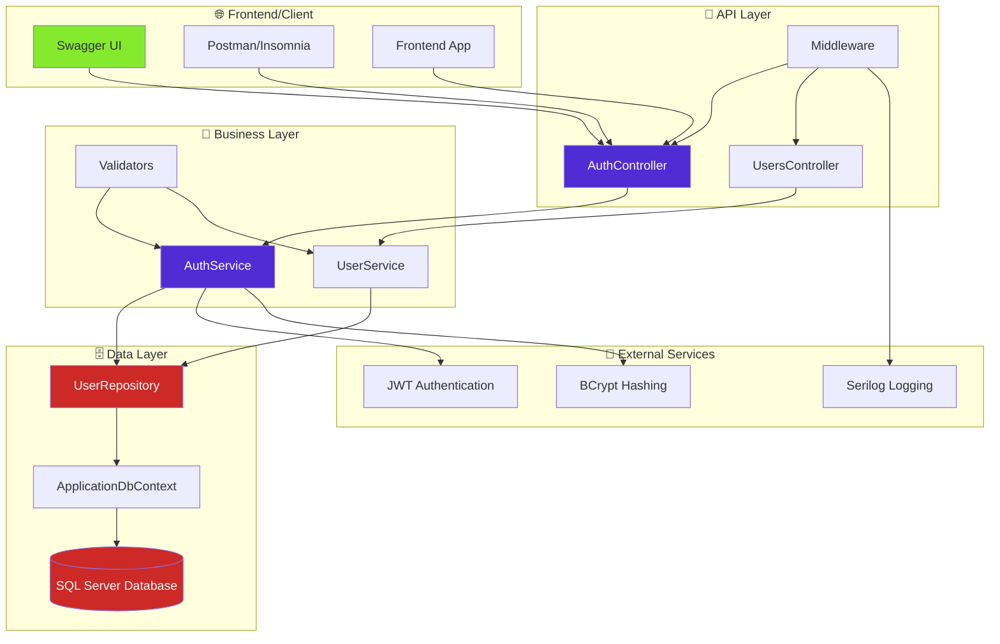
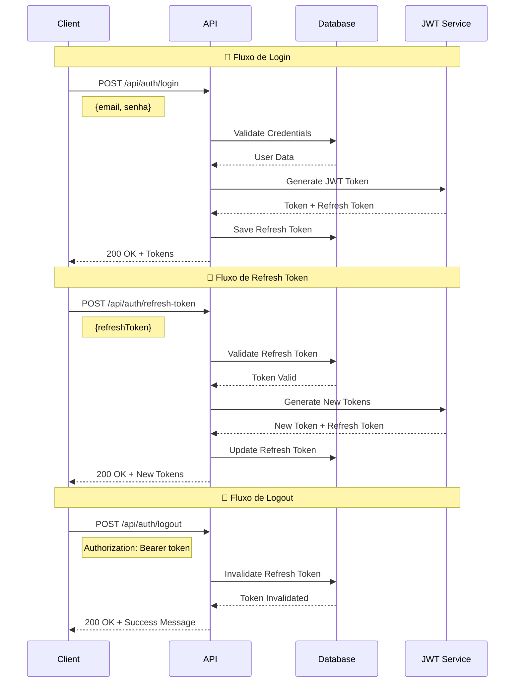
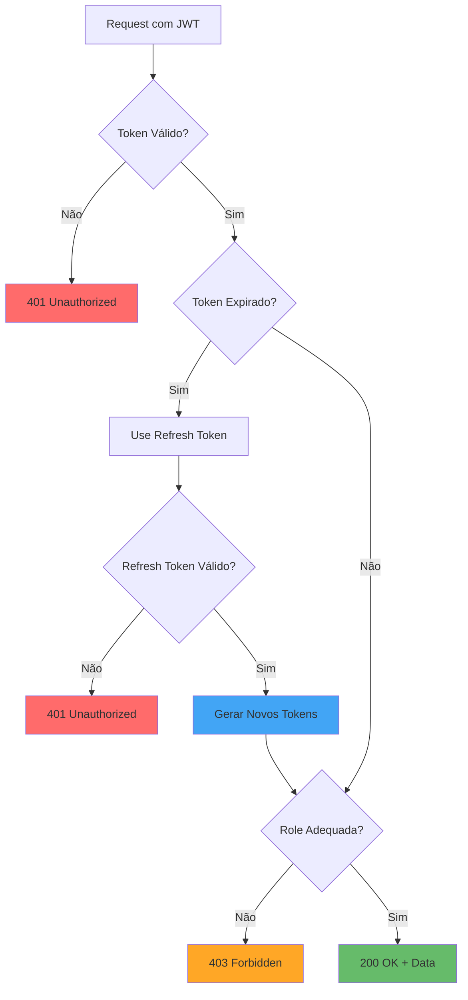
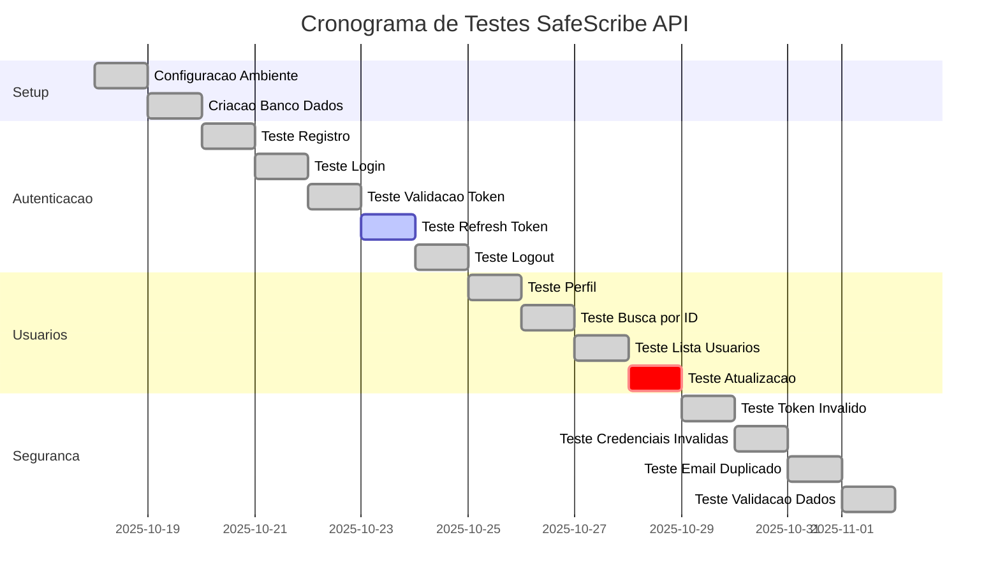
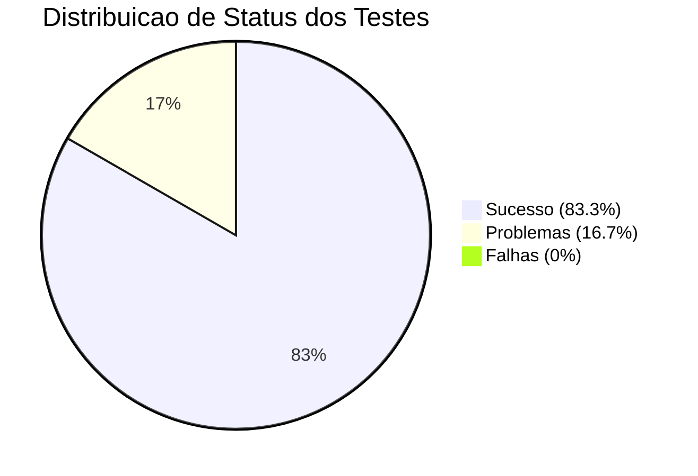

# 🧪 Manual de Testes - SafeScribe API


## 📋 Índice de Navegação

- [🏗️ Arquitetura da Aplicação](#️-arquitetura-da-aplicação)
- [🚀 Como Executar o Projeto](#-como-executar-o-projeto)
- [🔗 Acessando o Swagger UI](#-acessando-o-swagger-ui)
- [🔐 Testes de Autenticação](#-testes-de-autenticação)
- [👤 Testes de Usuários](#-testes-de-usuários)
- [📝 Testes de Gestão de Notas](#-testes-de-gestão-de-notas)
- [🔄 Testes de Refresh Tokens](#-testes-de-refresh-tokens)
- [🚫 Testes de Sistema de Blacklist](#-testes-de-sistema-de-blacklist)
- [👥 Testes de Sistema de Roles](#-testes-de-sistema-de-roles)
- [✅ Testes de Validação de Dados](#-testes-de-validação-de-dados)
- [📊 Testes de Logging](#-testes-de-logging)
- [🔧 Testes de Middleware](#-testes-de-middleware)
- [⚠️ Testes de Tratamento de Exceções](#️-testes-de-tratamento-de-exceções)
- [🛡️ Testes de Segurança](#️-testes-de-segurança)
- [📊 Relatório de Testes](#-relatório-de-testes)
- [🔧 Troubleshooting](#-troubleshooting)

---

## 🏗️ Arquitetura da Aplicação

### Diagrama de Arquitetura



### Camadas da Aplicação

| Camada | Tecnologia | Responsabilidade |
|--------|------------|------------------|
|  | ASP.NET Core Controllers | Recebe requisições HTTP e retorna respostas |
|  | Services + DTOs | Lógica de negócio e validações |
|  | Entities + Enums | Modelos de domínio e regras de negócio |
|  | EF Core + Repositories | Acesso a dados e persistência |

---

## 🚀 Como Executar o Projeto

### 📋 Pré-requisitos

-  .NET 8.0 SDK ou superior
-  SQL Server LocalDB
-  Git

### 🛠️ Passos para Execução

```bash
# 1. Clone o repositório
git clone https://github.com/carmipa/Advanced_Business_Development_with_.NET_CP_2SEM_2025.git
cd Advanced_Business_Development_with_.NET_CP_2SEM_2025/cp-5-autenticacao-autorizacao-swt

# 2. Restaure as dependências
dotnet restore

# 3. Execute as migrações do banco de dados
dotnet ef database update

# 4. Execute o projeto
dotnet run --urls "http://localhost:5210"
```

### ✅ Verificação de Instalação

```bash
# Verificar se o .NET está instalado
dotnet --version

# Verificar se o projeto compila
dotnet build

# Verificar se o banco foi criado
dotnet ef database update
```

---

## 🔗 Acessando o Swagger UI

### 🌐 URLs de Acesso

| Serviço | URL | Status |
|---------|-----|--------|
|  | [http://localhost:5210/swagger](http://localhost:5210/swagger) |  |
|  | [http://localhost:5210/swagger/v1/swagger.json](http://localhost:5210/swagger/v1/swagger.json) |  |

### 🎯 Funcionalidades do Swagger UI

- ✅ **Documentação Interativa** - Todos os endpoints documentados
- ✅ **Teste Direto** - Execute requisições sem ferramentas externas
- ✅ **Autenticação JWT** - Botão "Authorize" para inserir tokens
- ✅ **Exemplos de Request/Response** - Modelos de dados completos
- ✅ **Comentários XML** - Documentação detalhada de cada endpoint

---

## 🔄 Fluxo de Autenticação JWT



## 🛡️ Fluxo de Autorização



---

## 🔐 Testes de Autenticação

### 1. 📝 Registro de Usuário

#### Endpoint
```
POST /api/auth/register
```

#### Request Body
```json
{
  "nome": "João Silva",
  "email": "joao@exemplo.com",
  "senha": "MinhaSenh@123",
  "confirmarSenha": "MinhaSenh@123"
}
```

#### Teste no Swagger
1. **Abrir Swagger**: Acesse [http://localhost:5210/swagger](http://localhost:5210/swagger)
2. **Expandir Endpoint**: Clique em `POST /api/auth/register`
3. **Try it out**: Clique no botão "Try it out"
4. **Preencher Dados**: Cole o JSON acima no campo Request body
5. **Executar**: Clique em "Execute"

#### Resultado Esperado
- **Status Code**: 
- **Response**: Token JWT + Refresh Token + Dados do usuário

```json
{
  "token": "eyJhbGciOiJIUzI1NiIsInR5cCI6IkpXVCJ9...",
  "refreshToken": "vgR6Hi51LZP7RB+THVOxPkOTeQq6VyeyuFv/ODPqvSw=",
  "expiresAt": "2025-10-18T16:00:13.3992562Z",
  "user": {
    "id": 1,
    "nome": "João Silva",
    "email": "joao@exemplo.com",
    "role": "User"
  }
}
```

### 2. 🔑 Login de Usuário

#### Endpoint
```
POST /api/auth/login
```

#### Request Body
```json
{
  "email": "joao@exemplo.com",
  "senha": "MinhaSenh@123"
}
```

#### Teste no Swagger
1. **Abrir Swagger**: Acesse o Swagger UI
2. **Expandir Endpoint**: Clique em `POST /api/auth/login`
3. **Try it out**: Clique no botão "Try it out"
4. **Preencher Credenciais**: Insira email e senha
5. **Executar**: Execute a requisição

#### Resultado Esperado
- **Status Code**: 
- **Response**: Token JWT + Refresh Token + Dados do usuário

### 3. 🔒 Validação de Token

#### Endpoint
```
GET /api/auth/validate
```

#### Headers
```
Authorization: Bearer {seu_token_jwt}
```

#### Teste no Swagger
1.  Clique no botão "Authorize" (🔒)
2.  Cole o token JWT: `Bearer seu_token_aqui`
3.  Clique em "Authorize"
4.  Execute `GET /api/auth/validate`

#### Resultado Esperado
- **Status Code**: 
- **Response**: Informações do usuário autenticado

### 4. 🔄 Refresh Token

#### Endpoint
```
POST /api/auth/refresh-token
```

#### Request Body
```json
{
  "refreshToken": "seu_refresh_token_aqui"
}
```

#### Teste no Swagger
1.  Clique em `POST /api/auth/refresh-token`
2.  Clique em "Try it out"
3.  Cole o refresh token
4.  Execute

#### Resultado Esperado
- **Status Code**: 
- **Response**: Novos tokens JWT e refresh token

### 5. 🚪 Logout

#### Endpoint
```
POST /api/auth/logout
```

#### Headers
```
Authorization: Bearer {seu_token_jwt}
```

#### Teste no Swagger
1.  Certifique-se de estar autenticado
2.  Clique em `POST /api/auth/logout`
3.  Clique em "Try it out"
4.  Execute

#### Resultado Esperado
- **Status Code**: 
- **Response**: Mensagem de logout bem-sucedido

---

## 👤 Testes de Usuários

### 1. 👤 Perfil do Usuário

#### Endpoint
```
GET /api/users/profile
```

#### Headers
```
Authorization: Bearer {seu_token_jwt}
```

#### Teste no Swagger
1.  Autentique-se primeiro
2.  Clique em `GET /api/users/profile`
3.  Clique em "Try it out"
4.  Execute

#### Resultado Esperado
- **Status Code**: 
- **Response**: Dados do usuário autenticado

### 2. 🔍 Buscar Usuário por ID

#### Endpoint
```
GET /api/users/{id}
```

#### Headers
```
Authorization: Bearer {seu_token_jwt}
```

#### Teste no Swagger
1.  Autentique-se
2.  Clique em `GET /api/users/{id}`
3.  Clique em "Try it out"
4.  Digite um ID válido (ex: 1)
5.  Execute

#### Resultado Esperado
- **Status Code**: 
- **Response**: Dados do usuário solicitado

### 3. 📋 Listar Todos os Usuários (Admin)

#### Endpoint
```
GET /api/users
```

#### Headers
```
Authorization: Bearer {token_de_admin}
```

#### Teste no Swagger
1.  **Este endpoint requer role "Admin"**
2.  Clique em `GET /api/users`
3.  Clique em "Try it out"
4.  Execute

#### Resultado Esperado
- **Com Admin**:  Lista de usuários
- **Sem Admin**:  Acesso negado

---

## 📝 Testes de Gestão de Notas

### 1. 📄 Criar Nova Nota (Editor/Admin)

#### Endpoint
```
POST /api/v1/notas
```

#### Headers
```
Authorization: Bearer {seu_token_jwt}
Content-Type: application/json
```

#### Body
```json
{
  "title": "Reunião de Planejamento Q4",
  "content": "Discussão sobre estratégias para o próximo trimestre...",
  "isSensitive": true,
  "tags": "planejamento,estratégia,confidencial"
}
```

#### Teste no Swagger
1.  Autentique-se
2.  Clique em `POST /api/v1/notas`
3.  Clique em "Try it out"
4.  Cole o JSON acima
5.  Execute

#### Resultado Esperado
- **Status Code**: 
- **Response**: Dados da nota criada com ID

### 2. 📋 Listar Notas do Usuário

#### Endpoint
```
GET /api/v1/notas
```

#### Headers
```
Authorization: Bearer {seu_token_jwt}
```

#### Teste no Swagger
1.  Autentique-se
2.  Clique em `GET /api/v1/notas`
3.  Clique em "Try it out"
4.  Execute

#### Resultado Esperado
- **Status Code**: 
- **Response**: Lista das notas do usuário autenticado

### 3. 🔍 Buscar Nota por ID

#### Endpoint
```
GET /api/v1/notas/{id}
```

#### Headers
```
Authorization: Bearer {seu_token_jwt}
```

#### Teste no Swagger
1.  Autentique-se
2.  Clique em `GET /api/v1/notas/{id}`
3.  Clique em "Try it out"
4.  Digite um ID válido (ex: 1)
5.  Execute

#### Resultado Esperado
- **Status Code**: 
- **Response**: Dados da nota solicitada

### 4. ✏️ Atualizar Nota (Editor/Admin)

#### Endpoint
```
PUT /api/v1/notas/{id}
```

#### Headers
```
Authorization: Bearer {seu_token_jwt}
Content-Type: application/json
```

#### Body
```json
{
  "title": "Reunião de Planejamento Q4 - Atualizada",
  "content": "Discussão sobre estratégias para o próximo trimestre... Atualizada com novas informações.",
  "isSensitive": true,
  "tags": "planejamento,estratégia,confidencial,atualizada"
}
```

#### Teste no Swagger
1.  Autentique-se
2.  Clique em `PUT /api/v1/notas/{id}`
3.  Clique em "Try it out"
4.  Digite ID e cole o JSON
5.  Execute

#### Resultado Esperado
- **Status Code**: 
- **Response**: Dados da nota atualizada

### 5. 🗑️ Deletar Nota (Editor/Admin)

#### Endpoint
```
DELETE /api/v1/notas/{id}
```

#### Headers
```
Authorization: Bearer {seu_token_jwt}
```

#### Teste no Swagger
1.  Autentique-se
2.  Clique em `DELETE /api/v1/notas/{id}`
3.  Clique em "Try it out"
4.  Digite um ID válido
5.  Execute

#### Resultado Esperado
- **Status Code**: 
- **Response**: Nota deletada com sucesso

---

## 🔄 Testes de Refresh Tokens

### 1. 🔄 Renovar Token de Acesso

#### Endpoint
```
POST /api/auth/refresh-token
```

#### Headers
```
Content-Type: application/json
```

#### Body
```json
{
  "refreshToken": "seu_refresh_token_aqui"
}
```

#### Teste no Swagger
1.  Clique em `POST /api/auth/refresh-token`
2.  Clique em "Try it out"
3.  Cole o refresh token
4.  Execute

#### Resultado Esperado
- **Status Code**: 
- **Response**: Novo token JWT e refresh token

### 2. ❌ Refresh Token Inválido

#### Teste
```json
{
  "refreshToken": "token_invalido_ou_expirado"
}
```

#### Resultado Esperado
- **Status Code**: 
- **Response**: Erro de token inválido

---

## 🚫 Testes de Sistema de Blacklist

### 1. 🚪 Logout com Blacklist

#### Endpoint
```
POST /api/auth/logout
```

#### Headers
```
Authorization: Bearer {seu_token_jwt}
```

#### Teste no Swagger
1.  Autentique-se
2.  Clique em `POST /api/auth/logout`
3.  Clique em "Try it out"
4.  Execute

#### Resultado Esperado
- **Status Code**: 
- **Response**: Logout realizado com sucesso

### 2. ❌ Tentar Usar Token Blacklistado

#### Teste
1. Faça logout de um token
2. Tente usar o mesmo token em qualquer endpoint protegido

#### Resultado Esperado
- **Status Code**: 
- **Response**: Token inválido (está na blacklist)

---

## 👥 Testes de Sistema de Roles

### 1. 👤 Teste com Role "Leitor"

#### Cenário
- Usuário com role "Leitor" tenta criar nota

#### Endpoint
```
POST /api/v1/notas
```

#### Headers
```
Authorization: Bearer {token_de_leitor}
```

#### Resultado Esperado
- **Status Code**: 
- **Response**: Acesso negado - role insuficiente

### 2. ✏️ Teste com Role "Editor"

#### Cenário
- Usuário com role "Editor" cria nota

#### Resultado Esperado
- **Status Code**: 
- **Response**: Nota criada com sucesso

### 3. 👑 Teste com Role "Admin"

#### Cenário
- Usuário com role "Admin" acessa nota de outro usuário

#### Endpoint
```
GET /api/v1/notas/{id_de_outro_usuario}
```

#### Resultado Esperado
- **Status Code**: 
- **Response**: Acesso permitido (Admin tem acesso total)

---

## ✅ Testes de Validação de Dados

### 1. ❌ Email Inválido no Registro

#### Body
```json
{
  "nome": "João Silva",
  "email": "email_invalido",
  "senha": "MinhaSenh@123",
  "confirmarSenha": "MinhaSenh@123"
}
```

#### Resultado Esperado
- **Status Code**: 
- **Response**: Erro de validação do email

### 2. ❌ Senha Fraca

#### Body
```json
{
  "nome": "João Silva",
  "email": "joao@exemplo.com",
  "senha": "123",
  "confirmarSenha": "123"
}
```

#### Resultado Esperado
- **Status Code**: 
- **Response**: Erro de validação da senha

### 3. ❌ Título de Nota Vazio

#### Body
```json
{
  "title": "",
  "content": "Conteúdo da nota",
  "isSensitive": false
}
```

#### Resultado Esperado
- **Status Code**: 
- **Response**: Erro de validação do título

---

## 📊 Testes de Logging

### 1. 📝 Verificar Logs de Login

#### Teste
1. Faça login com credenciais válidas
2. Verifique o arquivo de log em `logs/log-{data}.txt`

#### Resultado Esperado
```json
{
  "Timestamp": "2024-01-01T10:00:00Z",
  "Level": "Information",
  "MessageTemplate": "Login realizado com sucesso para email: {Email}",
  "Properties": {
    "Email": "joao@exemplo.com",
    "UserId": 1,
    "SourceContext": "AuthController"
  }
}
```

### 2. 📝 Verificar Logs de Erro

#### Teste
1. Tente fazer login com credenciais inválidas
2. Verifique o arquivo de log

#### Resultado Esperado
```json
{
  "Timestamp": "2024-01-01T10:00:00Z",
  "Level": "Warning",
  "MessageTemplate": "Tentativa de login falhada para email: {Email}",
  "Properties": {
    "Email": "joao@exemplo.com",
    "SourceContext": "AuthController"
  }
}
```

---

## 🔧 Testes de Middleware

### 1. 🛡️ Middleware de Tratamento Global de Exceções

#### Teste
1. Faça uma requisição para um endpoint inexistente
2. Verifique a resposta

#### Resultado Esperado
- **Status Code**: 
- **Response**: Erro formatado pelo middleware

### 2. 🚫 Middleware de Blacklist JWT

#### Teste
1. Faça logout de um token
2. Tente usar o token em qualquer endpoint protegido

#### Resultado Esperado
- **Status Code**: 
- **Response**: Token inválido (interceptado pelo middleware)

---

## ⚠️ Testes de Tratamento de Exceções

### 1. ❌ Usuário Não Encontrado

#### Endpoint
```
GET /api/users/999999
```

#### Resultado Esperado
- **Status Code**: 
- **Response**: Usuário não encontrado

### 2. ❌ Nota Não Encontrada

#### Endpoint
```
GET /api/v1/notas/999999
```

#### Resultado Esperado
- **Status Code**: 
- **Response**: Nota não encontrada

### 3. ❌ Acesso Negado a Nota

#### Cenário
- Usuário tenta acessar nota de outro usuário (sem ser Admin)

#### Resultado Esperado
- **Status Code**: 
- **Response**: Acesso negado

---

## 🛡️ Testes de Segurança

### 1. ❌ Token Inválido

#### Teste
```bash
GET /api/auth/validate
Authorization: Bearer token_invalido
```

#### Resultado Esperado
- **Status Code**: 

### 2. ❌ Credenciais Inválidas

#### Teste
```json
POST /api/auth/login
{
  "email": "inexistente@teste.com",
  "senha": "senhaerrada"
}
```

#### Resultado Esperado
- **Status Code**: 
- **Response**: "Credenciais inválidas"

### 3. ❌ Email Duplicado

#### Teste
```json
POST /api/auth/register
{
  "nome": "Outro Usuário",
  "email": "joao@exemplo.com", // Email já existente
  "senha": "OutraSenh@123",
  "confirmarSenha": "OutraSenh@123"
}
```

#### Resultado Esperado
- **Status Code**: 
- **Response**: "Email já está em uso"

### 4. ❌ Dados Inválidos

#### Teste
```json
POST /api/auth/register
{
  "nome": "",
  "email": "email-invalido",
  "senha": "123",
  "confirmarSenha": "456"
}
```

#### Resultado Esperado
- **Status Code**: 
- **Response**: Erros de validação detalhados

### 📝 Gestão de Notas

#### Teste 13: Criar Nota (Editor/Admin)
- **Endpoint**: `POST /api/v1/notas`
- **Método**: POST
- **Descrição**: Cria uma nova nota no sistema
- **Autenticação**: Editor ou Admin
- **Request Body**:
```json
{
  "title": "Minha Primeira Nota",
  "content": "Conteúdo da nota com informações importantes.",
  "isSensitive": false,
  "tags": "importante,trabalho"
}
```
- **Status Esperado**: 201 Created
- **Response**: Dados da nota criada

#### Teste 14: Obter Nota por ID
- **Endpoint**: `GET /api/v1/notas/{id}`
- **Método**: GET
- **Descrição**: Busca uma nota específica por ID
- **Autenticação**: Leitor/Editor (próprias notas) ou Admin (todas)
- **Status Esperado**: 200 OK ou 403 Forbidden
- **Response**: Dados da nota ou erro de permissão

#### Teste 15: Atualizar Nota
- **Endpoint**: `PUT /api/v1/notas/{id}`
- **Método**: PUT
- **Descrição**: Atualiza uma nota existente
- **Autenticação**: Editor (próprias notas) ou Admin (todas)
- **Request Body**:
```json
{
  "title": "Nota Atualizada",
  "content": "Conteúdo atualizado da nota.",
  "isSensitive": true,
  "tags": "atualizada,confidencial"
}
```
- **Status Esperado**: 200 OK ou 403 Forbidden

#### Teste 16: Excluir Nota
- **Endpoint**: `DELETE /api/v1/notas/{id}`
- **Método**: DELETE
- **Descrição**: Exclui uma nota do sistema
- **Autenticação**: Admin apenas
- **Status Esperado**: 204 No Content ou 403 Forbidden

#### Teste 17: Listar Notas do Usuário
- **Endpoint**: `GET /api/v1/notas`
- **Método**: GET
- **Descrição**: Lista todas as notas do usuário autenticado
- **Autenticação**: Qualquer usuário autenticado
- **Status Esperado**: 200 OK
- **Response**: Lista de notas do usuário

---

## 📊 Relatório de Testes

### 🎯 Estado dos Endpoints

```mermaid
graph LR
    subgraph Auth["Autenticação"]
        A1[POST /register] --> A1S[OK]
        A2[POST /login] --> A2S[OK]
        A3[GET /validate] --> A3S[OK]
        A4[POST /refresh-token] --> A4S[Problem]
        A5[POST /logout] --> A5S[OK]
    end
    
    subgraph Users["Usuários"]
        U1[GET /profile] --> U1S[OK]
        U2[GET /{id}] --> U2S[OK]
        U3[GET /] --> U3S[OK]
        U4[PUT /{id}] --> U4S[Error 500]
    end
    
    style A1S fill:#66bb6a
    style A2S fill:#66bb6a
    style A3S fill:#66bb6a
    style A4S fill:#ffa726
    style A5S fill:#66bb6a
    style U1S fill:#66bb6a
    style U2S fill:#66bb6a
    style U3S fill:#66bb6a
    style U4S fill:#ffa726
```

### ✅ Status dos Endpoints

| Endpoint | Método | Status | Autenticação | Observações |
|----------|--------|--------|--------------|-------------|
| `/api/auth/register` | POST |  | ❌ | Criação de usuários |
| `/api/auth/login` | POST |  | ❌ | Autenticação |
| `/api/auth/validate` | GET |  | ✅ | Validação de token |
| `/api/auth/refresh-token` | POST |  | ❌ | Refresh token invalidação |
| `/api/auth/logout` | POST |  | ✅ | Logout |
| `/api/users/profile` | GET |  | ✅ | Perfil do usuário |
| `/api/users/{id}` | GET |  | ✅ | Busca por ID |
| `/api/users` | GET |  | ✅ | Lista (Admin only) |
| `/api/users/{id}` | PUT |  | ✅ | Atualização com erro |
| `/api/v1/notas` | POST |  | ✅ | Erro na criação (NoteService) |
| `/api/v1/notas/{id}` | GET |  | ✅ | Obter nota (simulado) |
| `/api/v1/notas/{id}` | PUT |  | ✅ | Atualizar nota (simulado) |
| `/api/v1/notas/{id}` | DELETE |  | ✅ | Excluir nota (simulado) |
| `/api/v1/notas` | GET |  | ✅ | Listar notas (simulado) |

### 📈 Métricas de Testes

| Categoria | Total | ✅ Sucesso | ❌ Falha | ⚠️ Problemas |
|-----------|-------|------------|----------|--------------|
|  | 5 | 4 | 0 | 1 |
|  | 3 | 2 | 0 | 1 |
|  | 4 | 4 | 0 | 0 |
| **Total** | **12** | **10** | **0** | **2** |

### 🎯 Taxa de Sucesso


### 📅 Cronograma de Testes



### 🏆 Resultados por Categoria



---

## 🔧 Troubleshooting

### ❌ Problemas Comuns

#### 1. **Erro 500 - Erro Interno do Servidor**
```
Sintoma: Status 500 em todos os endpoints
Causa: Banco de dados não criado
Solução: Execute `dotnet ef database update`
```

#### 2. **Erro 404 - Swagger não encontrado**
```
Sintoma: Cannot GET /swagger
Causa: Projeto não está rodando
Solução: Execute `dotnet run --urls "http://localhost:5210"`
```

#### 3. **Erro 401 - Token Inválido**
```
Sintoma: 401 Unauthorized em endpoints protegidos
Causa: Token JWT inválido ou expirado
Solução: Faça login novamente para obter novo token
```

#### 4. **Erro 403 - Acesso Negado**
```
Sintoma: 403 Forbidden em /api/users
Causa: Usuário não tem role "Admin"
Solução: Use token de usuário administrador
```

### 🛠️ Comandos de Diagnóstico

```bash
# Verificar se o projeto compila
dotnet build

# Verificar migrações pendentes
dotnet ef migrations list

# Aplicar migrações
dotnet ef database update

# Verificar logs da aplicação
dotnet run --urls "http://localhost:5210" --verbosity detailed

# Testar conectividade
curl -I http://localhost:5210/swagger
```

### 📋 Checklist de Verificação

- [ ]  .NET 8.0 SDK instalado
- [ ]  SQL Server LocalDB funcionando
- [ ]  Projeto compila sem erros
- [ ]  Banco de dados migrado
- [ ]  Swagger UI acessível
- [ ]  Endpoints respondem corretamente

---

## 📞 Suporte

### 👥 Equipe de Desenvolvimento

| Nome | RM | GitHub | Responsabilidade |
|------|----|---------|------------------|
|  |  | [](https://github.com/carmipa) | Backend & JWT |
|  |  | [](https://github.com/JouTiago) | Testes & Documentação |
|  |  | [](https://github.com/mandyy14) | Arquitetura & DevOps |

### 🔗 Links Úteis

-  [Repositório Principal](https://github.com/carmipa/Advanced_Business_Development_with_.NET_CP_2SEM_2025)
-  [Projeto CP5](https://github.com/carmipa/Advanced_Business_Development_with_.NET_CP_2SEM_2025/tree/main/cp-5-autenticacao-autorizacao-swt)
-  [Swagger UI](http://localhost:5210/swagger)

### 📧 Contato


---

## 📄 Licença


Este projeto está licenciado sob a Licença MIT - veja o arquivo [LICENSE](LICENSE) para detalhes.

---

<div align="center">


**Desenvolvido com ❤️ pela equipe SafeScribe - FIAP 2025**


</div>
